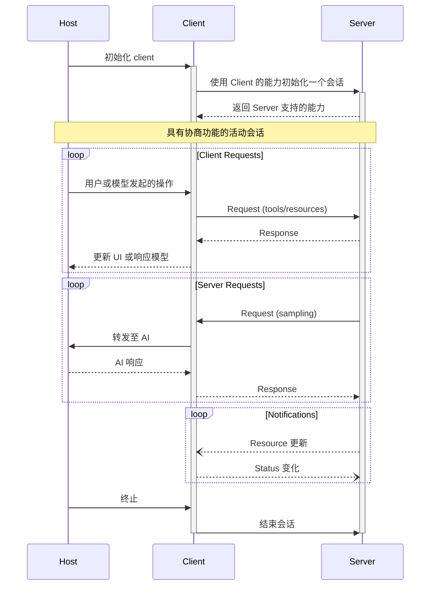
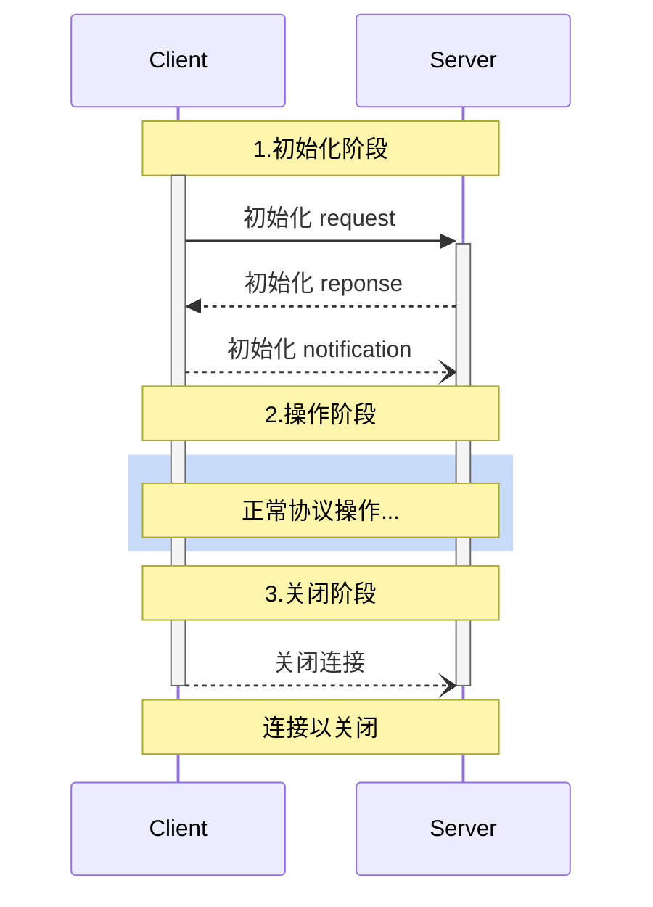

## 1. 什么是 MCP

MCP（Model Context Protocol，模型上下文协议）最早由 Anthropic 于 2024 年 11 月 25 日在文章《Introducing the Model Context Protocol》中提出。

它旨在定义一种标准，用于在应用程序与大型语言模型（LLM）之间交换上下文信息。借助 MCP，开发者可以以统一的方式将数据、工具和环境提供给 AI，让 AI 不再局限于“回答问题”，而是具备“执行任务”的能力。

你可以把 MCP 理解为 AI 的 **Type-C 接口**：就像 Type-C 让电脑能连接显示器、键盘、耳机一样，MCP 也让语言模型（如 Claude、GPT）能够标准化、安全地访问外部工具、文件、数据库和上下文资源。


MCP 的诞生源于解决 LLM 应用的一个关键限制，即它们与外部和数据源工具的隔离问题。
LLM 应用的一个核心关注点是数据传输，即如何将数据提供给 LLM 进行推理。这一直是 RAG 和微调的目标，同时也是 MCP 的目标。

## 2. 为什么需要 MCP？

在没有 MCP 之前，使用 AI 往往意味着用户需要手动搜集并打包所有上下文信息，一次性地通过 prompt 提供给模型，然后静待其生成回答。

这通常要求用户亲自查询数据库、搜索网页、复制粘贴内容，并将其组织成 prompt 格式。随着任务复杂度不断提高，用户对模型的期望也在上升——他们希望模型能直接访问文件、数据库、实时信息等外部资源，以提供更加准确、上下文相关的响应。

为满足这一需求，许多 LLM 平台陆续引入了 Function Calling：模型可以在运行时调用开发者注册的函数，实现自动获取数据或触发操作，从而显著提升交互性和自动化能力。

然而，Function Calling 本身也存在局限。各家平台（如 OpenAI、Google、Anthropic）虽都提供此能力，但缺乏统一标准，函数结构、调用协议各异，导致开发者必须为每个平台分别编写和适配工具逻辑，增加了维护负担和重复开发成本。

MCP（Model Context Protocol）正是为了解决这一碎片化问题而诞生。它定义了模型与外部工具之间的统一通信协议，相当于 AI 世界中的“万能插头”，为模型与现实世界之间架起一座标准化的桥梁。

相较于传统的 Function Calling，MCP 具有以下优势：

- **✅ 标准化接口**：开发者可以使用统一格式为不同模型接入工具，无需重复适配。
- **🌱 生态丰富**：已有众多第三方工具、组件和框架支持 MCP，生态逐渐成熟。
- **🔐 安全可靠**：支持在本地或受控环境中执行工具调用，避免上传敏感数据。

## **3. 基本概念**

| 名称               | 类型                    | 说明                                                                                       |
| ------------------ | ----------------------- | ------------------------------------------------------------------------------------------ |
| **Tools 工具**     | Server 提供的可调用工具 | MCP Server 提供的功能方法，如搜索仓库、获取天气，Client 通过`tools/list`和`tools/call`使用 |
| **Resources 资源** | Server 提供的可读数据   | 文档、API 数据、文件等。通过`resources/list`和`resources/read`获取内容                     |
| **Prompts 提示**   | 提示词模板系统          | MCP Server 提供的提示模板，用于丰富模型提示构造，Client 通过`prompts/list`使用             |
| **Sampling 采样**  | 推理生成相关能力        | MCP Server 可通过`sampling/createMessage`请求语言模型生成响应                              |
| **Roots**          | 文件系统挂载根          | 用于暴露本地文件系统目录给 MCP Server                                                      |
| **Capabilities**   | 初始化协商的功能清单    | Client 和 Server 协商功能能力（如是否支持工具列表变更、资源订阅等）                        |

## 4. MCP 架构和通讯机制

### 4.1 总体架构

MCP 遵循客 **客户端-服务器架构**，主机程序（如 Claude Desktop）可以连接多个后端服务（即 MCP 服务器），就像浏览器可以连接多个网站一样。


- **MCP Hosts**：像 Claude Desktop、IDE 或 AI 工具等程序，它们希望通过 MCP 访问数据。
  宿主进程充当容器和协调器：
  - 创建和管理多个客户端实例
  - 控制客户端连接权限和生命周期
  - 执行安全政策和同意要求
  - 处理用户授权决策
  - 协调 AI/LLM 集成和采样
  - 管理跨客户端的上下文聚合
- **MCP Clients**：与服务器保持 1:1 连接的协议客户端。
  每个客户端由主机创建并维护一个隔离的服务器连接：
  - 每个服务器建立一个有状态会话
  - 处理协议协商和能力交换
  - 双向路由协议消息
  - 管理订阅和通知
  - 维护服务器之间的安全边界
    主机应用程序创建并管理多个客户端，每个客户端与特定服务器具有 1:1 的关系。
    
- **MCP Servers**：通过标准化的模型上下文协议暴露特定功能的轻量级程序。
  服务器提供专门的上下文和功能：
  - 通过 MCP 原语公开资源、工具和提示
  - 独立运作，专注负责
  - 通过客户端界面请求采样
  - 必须尊重安全约束
  - 可以是本地进程或远程服务
- **Local Data Source**：计算机文件、数据库以及 MCP 服务器可以安全访问的服务。
- **Remote Services**：MCP 服务器可以通过 API 等方式连接到的互联网外部系统。

**整体运行流程总结**：

当你向 AI 提出问题时，流程是这样的：

- 提问 ➜ Host ➜ LLM ➜ MCP Client ➜ MCP Server ➜ 执行操作 ➜ 返回结果 ➜ LLM 生成回答 ➜ 展示答案

这样的架构设计可以让 LLM 更灵活地调用各种数据和工具。开发者只需专注于开发 MCP Server，用户也无需额外学习成本，就能获得智能化体验。

### 4.2 传输协议

> [!NOTE] > [📖 Source](https://modelcontextprotocol.io/specification/2025-03-26/basic/transports#stdiohttps://github.com/modelcontextprotocol/modelcontextprotocol/blob/e0a7d3b7cc286496b5a4585be85e6bd4ff186e36/docs/specification/2025-03-26/basic/transports.mdx?plain=1)

协议目前定义了两种标准传输机制用于客户端与服务器通信：

1. **stdio**，标准输入和标准输出的通信
2. **Streamable HTTP** 可流式传输的 HTTP

客户端和服务端也可以以插件的形式实现自定义传输。

|  **特性**  | **stdio** | **Streamable HTTP** |
| :--------: | :-------: | :-----------------: |
| 实现复杂度 |   简单    |        中等         |
|    性能    |    高     |        中等         |
|  网络支持  |    ❌     |         ✅          |
|  多客户端  |    ❌     |         ✅          |
|  流式响应  |    ❌     |         ✅          |
|  会话管理  |    ❌     |         ✅          |
|  断线重连  |    ❌     |         ✅          |
|  调试难度  |    低     |        中等         |
| 部署复杂度 |    低     |        中等         |
|  适用场景  | 本地工具  |  Web 应用/远程服务  |

- **4.2.1 Stdio**

  在 stdio 传输中，客户端将 MCP 服务器作为子进程启动。服务器从标准输入（ `stdin` ）读取 JSON-RPC 消息，并将消息发送到标准输出（ `stdout` ）。消息可以是 JSON-RPC 请求、通知、响应——或者包含一个或多个请求和/或通知的 JSON-RPC 批处理。

  stdio 传输是 MCP 最基础的传输方式，它通过标准输入输出流（stdin/stdout）进行通信：

  ```mermaid
  sequenceDiagram
      participant Client
      participant Server Process

      Client->>+Server Process: 启动子进程 # Launch subprocess
      loop 消息交换 # Message Exchange
          Client->>Server Process: 写入标准输入 # Write to stdin
          Server Process->>Client: 写入标准输出 # Write to stdout
          Server Process--)Client: 可选的 stderr 日志 # Optional logs on stderr
      end
      Client->>Server Process: 关闭标准输入，终止子进程 # Close stdin, terminate subprocess
      deactivate Server Process
  ```

  - Client → Server: 通过 stdin 发送 JSON-RPC 消息
  - Server → Client: 通过 stdout 返回 JSON-RPC 响应
  - stderr: 用于日志和调试信息输出

  每条消息都是独立的 JSON 行：

  ```json
  {"jsonrpc": "2.0", "id": 1, "method": "tools/list", "params": {}}
  {"jsonrpc": "2.0", "id": 1, "result": {"tools": [...]}}
  ```

- **4.2.2 Streamable HTTP 传输**

  > [!TIP] > **🚨 重要说明**
  >
  > **Streamable HTTP** 是 MCP 协议 2025-03-26 版本中的正式传输方式，它替代了之前版本（2024-11-05）的 **HTTP+SSE** 传输。

  Streamable HTTP 基于 HTTP协议，可以选择性地使用 Server-Sent Events (SSE) 实现流式通信：

  **核心特点**：

  1. 统一端点: 服务器提供单个 HTTP 端点，同时支持 POST 和 GET 方法
  2. 灵活响应: 服务器可以返回简单 JSON 响应或 SSE 流
  3. 双向通信: 支持客户端到服务器和服务器到客户端的消息传

  ### 消息交换模式

  ```
  POST /mcp HTTP/1.1
  Content-Type: application/json
  Accept: application/json, text/event-stream

  {"jsonrpc": "2.0", "id": 1, "method": "tools/list", "params": {}}
  ```

  ### Server 响应方式

  - 方式1: JSON 响应

    ```http
    HTTP/1.1 200 OK
    Content-Type: application/json

    {"jsonrpc": "2.0", "id": 1, "result": {"tools": [...]}}

    ```

  - 方式2: SSE 流响应

    ```http
    HTTP/1.1 200 OK
    Content-Type: text/event-stream

    data: {"jsonrpc": "2.0", "id": 1, "result": {"tools": [...]}}

    data: {"jsonrpc": "2.0", "method": "notifications/progress", "params": {...}}
    ```

  ### Server → Client 通信

  服务器可以通过 GET 请求建立 SSE 流来主动发送消息：

  ```http
  GET /mcp HTTP/1.1
  Accept: text/event-stream
  ```

  ### 与之前版本的区别

  以下是两种传输方式的主要差异对比：

  | **特性**   | **HTTP+SSE (2024-11-05)** | **Streamable HTTP (2025-03-26)** |
  | ---------- | ------------------------- | -------------------------------- |
  | 端点数量   | 分离的 POST/SSE 端点      | 统一的 MCP 端点                  |
  | 协议复杂度 | 相对复杂                  | 简化统一                         |
  | 灵活性     | 有限                      | 高度灵活                         |
  | 向后兼容   | 已废弃                    | 支持向后兼容                     |

### 4.3 **基本消息类型**

MCP 定义了基于 JSON-RPC 2.0 的三种核心消息类型：

- **Requests**: 双向消息，带有方法和参数，期望有响应
- **Responses**: 匹配特定请求 ID 的成功结果或错误
- **Notifications**: 无需回复的单向消息

### 4.4 **能力协商**

Model Context Protocol 使用了一种基于能力（Capability Negotiation）的协商机制，在初始化阶段，Clients 和 Servers 会明确声明它们支持的功能，而这些能力决定了在会话期间可以使用哪些协议特性和原语（primitives）



1. **初始化阶段**
   1. **Host 初始化 Client**
      启动一个 MCP 客户端，如加载一个插件、Agent、AgentUI。
   2. **Client 请求初始化会话**
      Client 向 MCP Server 发起 `describe` 或 `start_session` 请求，询问有哪些 Agent、Tool、Context 可用。
   3. **Server 返回支持的能力**
      Server 响应 Server 端具备的能力信息（模型种类、最大 token、支持的工具类型等）。
2. **Client Requests 循环（用户侧的请求）**
   1. **用户或模型发起操作**
      比如点击一个按钮、用户输入一句话，或者 Agent 逻辑决定调用某个工具。
   2. **Client 构造请求并发送给 Server**
      请求中包含需要调用的 Tool、访问的资源（如文档、搜索、函数 API）。
   3. **Server 处理并返回 Response**
      MCP Server 调用对应工具（可能是插件、Web API、本地函数）并返回结果。
   4. **Client 处理响应并反馈给 Host（更新 UI 或继续对话）**
      更新页面状态、填入回答，或进一步触发 Agent 推理。
3. **Server Requests 循环（AI 推理请求）**
   1. **Server 请求采样**
      也就是请求模型进行语言生成（`chat.complete` / `run.sample`）。
   2. **Client 将请求转发至 Host（语言模型）**
      Host 通常包含模型推理能力（本地模型或 OpenAI API 等远程模型）。
   3. **Host 生成回答并返回给 Client**
   4. **Client 再返回给 Server，继续任务流程**

### 4.5 **协议规范之基本消息类型**

> [!NOTE] > [📖 Source](https://modelcontextprotocol.io/specification/draft/basic/index#notifications)

所有在 MCP clients 和 servers 之间的消息必须遵循 `JSON-RPC 2.0` 规范。该协议定义了三种基本类型的消息：

| **消息类型**    | **描述**                     |
| --------------- | ---------------------------- |
| `Requests`      | 请求期望从对方得到响应       |
| `Results`       | 结果是对请求的成功响应       |
| `Notifications` | 一次性的消息，不需要接收响应 |

1. **Request 消息请求**

   请求由客户端发送至服务器，或由服务器发送至客户端，以启动一项操作，格式：

   ```tsx
   {
     jsonrpc: "2.0";
     id: string | number;
     method: string;
     params?: {
       [key: string]: unknown;
     };
   }
   ```

   - 请求**必须**包含一个字符串或整数 ID。
   - 与基础 JSON-RPC 不同，ID **不得**为 `null`。
   - 在同一会话中，请求方**不得**重复使用之前已用过的请求 ID。

   **业务类型：**

   | **请求方法**             | **发起方** | **响应方** | **描述**                                                           |
   | ------------------------ | ---------- | ---------- | ------------------------------------------------------------------ |
   | initialize               | Client     | Server     | 初始化会话                                                         |
   | tools/list               | Client     | Server     | 发现可用的工具                                                     |
   | tools/call               | Client     | Server     | 调用工具                                                           |
   | resources/list           | Client     | Server     | 发现可用的资源                                                     |
   | resources/read           | Client     | Server     | 要获取资源内容                                                     |
   | resources/templates/list | Client     | Server     | 发现可用的参数化资源                                               |
   | resources/subscribe      | Client     | Server     | 订阅特定资源，并在其发生变化时接收通知                             |
   | prompts/list             | Client     | Server     | 发现可用的提示词                                                   |
   | prompts/get              | Client     | Server     | 要获取特定的提示词                                                 |
   | roots/list               | Server     | Client     | 列出 Server 有权限访问 Client 的文件系统 Root 节点，暴露目录和文件 |
   | sampling/createMessage   | Server     | Client     | 使 Server 能够利用 AI 能力的生成能力                               |

2. **Response 消息响应**

   Response 是对 Request 的响应，格式：

   ```tsx
   {
     jsonrpc: "2.0";
     id: string | number;
     result?: {
       [key: string]: unknown;
     }
     error?: {
       code: number;
       message: string;
       data?: unknown;
     }
   }
   ```

   - 响应**必须**包含与其对应的请求相同的 ID。
   - **响应**进一步细分为 **成功结果** 或 **错误**。**必须**设置一个`result`或`error`。响应**不得**同时设置两者。
   - 结果**可以**遵循任何 JSON 对象结构，而错误**必须**至少包含错误代码和消息。
   - 错误代码**必须**是整数。

3. **Notifications（通知）**

   `Notifications`以单向消息的形式从客户端发送到服务器，反之亦然。接收方不得发送响应。

   ```tsx
   {
     jsonrpc: "2.0";
     method: string;
     params?: {
       [key: string]: unknown;
     };
   }
   ```

   通知不得包含 ID。

4. **举例：Client 获取 Server Tool 列表**

   > [!NOTE] > [📖 Source](https://modelcontextprotocol.io/specification/2025-03-26/server/tools#list-changed-notificationhttps://github.com/modelcontextprotocol/modelcontextprotocol/blob/e0a7d3b7cc286496b5a4585be85e6bd4ff186e36/docs/specification/2025-03-26/server/tools.mdx#L147)

   ```mermaid
   sequenceDiagram
       participant LLM
       participant Client
       participant Server

       Note over Client,Server: 查找可用的 Tool 列表 # Discovery
       Client->>Server: tools/list
       Server-->>Client: List of tools

       Note over Client,LLM: Tool 筛选 # Tool Selection
       LLM->>Client: 选择需要用到的 Tool # Select tool to use

       Note over Client,Server: 调用 # Invocation
       Client->>Server: tools/call
       Server-->>Client: Tool result
       Client->>LLM: 处理结果 # Process result

       Note over Client,Server: 更新 # Updates
       Server--)Client: tools/list_changed
       Client->>Server: tools/list
       Server-->>Client: Updated tools

   ```

   要查询可用的工具，Client发送一个 `tools/list` 请求。

   **Request**

   ```json
   {
     "jsonrpc": "2.0",
     "id": 1,
     "method": "tools/list",
     "params": {
       "cursor": "optional-cursor-value"
     }
   }
   ```

   **Response**

   ```json
   {
     "jsonrpc": "2.0",
     "id": 1,
     "result": {
       "tools": [
         {
           "name": "get_weather",
           "description": "Get current weather information for a location",
           "inputSchema": {
             "type": "object",
             "properties": {
               "location": {
                 "type": "string",
                 "description": "City name or zip code"
               }
             },
             "required": ["location"]
           }
         }
       ],
       "nextCursor": "next-page-cursor"
     }
   }
   ```

### 4.6 **生命周期**

> [!NOTE] > [📖 Source](https://modelcontextprotocol.io/specification/2025-03-26/basic/lifecycle#lifecyclehttps://github.com/modelcontextprotocol/modelcontextprotocol/blob/e0a7d3b7cc286496b5a4585be85e6bd4ff186e36/docs/specification/2025-03-26/basic/lifecycle.mdx)

模型上下文协议 (MCP) 为 client-server 连接定义了严格的生命周期，以确保正确的能力协商和状态管理。

1. **Initialization（初始化）**：能力协商和协议版本协商
2. **Operation（操作）**：正常协议通信
3. **Shutdown（终止）**：正常终止连接



1. **Initialization (初始化)**

   初始化阶段 **必须** 是客户端与服务器之间的首次交互。在此阶段，客户端和服务器需完成以下操作：

   - 建立协议版本兼容性
   - 交换并协商功能能力
   - 共享实现细节

   客户端 **必须** 通过发送包含以下内容的 `initialize` 请求来启动此阶段：

   - 支持的协议版本
   - 客户端功能能力
   - 客户端实现信息

   ```json
   {
     "jsonrpc": "2.0",
     "id": 1,
     "method": "initialize", // 调用的方法名，这是MCP协议中的初始化握手请求
     "params": {
       "protocolVersion": "2025-03-26", // 指定客户端支持的MCP协议版本
       "capabilities": {
         // 客户端声明的功能能力
         "roots": {
           "listChanged": true // 表示客户端支持根目录变更通知功能
         },
         "sampling": {} // 表示客户端支持采样功能（具体配置为空对象）
       },
       "clientInfo": {
         // 客户端实现信息
         "name": "ExampleClient", // 客户端名称
         "version": "1.0.0" // 客户端版本号
       }
     }
   }
   ```

   初始化请求 **必须不在** JSON-RPC [批处理](https://www.jsonrpc.org/specification#batch)中，因为在初始化完成之前无法发送其他请求和通知。这也允许与之前不明确支持 JSON-RPC 批处理的协议版本保持向后兼容。

   > [!TIP]
   > 简单说，就是初始化请求必须独立发送，不能和其他请求打包在一起，这样确保了协议的稳定性和兼容性。

   服务器 **必须** 返回其自身的功能和信息：

   ```json
   {
     "jsonrpc": "2.0",
     "id": 1, // 对应初始化请求的ID，用于匹配请求和响应
     "result": {
       "protocolVersion": "2025-03-26", // 服务端支持的MCP协议版本
       "capabilities": {
         // 服务端支持的功能能力声明
         "logging": {}, // 日志功能支持（空对象表示基础支持）
         "prompts": {
           // 提示词功能支持
           "listChanged": true // 支持提示词列表变更通知
         },
         "resources": {
           // 资源功能支持
           "subscribe": true, // 支持资源订阅功能
           "listChanged": true // 支持资源列表变更通知
         },
         "tools": {
           // 工具功能支持
           "listChanged": true // 支持工具列表变更通知
         }
       },
       "serverInfo": {
         // 服务端身份信息
         "name": "ExampleServer", // 服务端名称
         "version": "1.0.0" // 服务端版本号
       },
       "instructions": "Optional instructions for the client" // 可选的客户端使用说明或配置指引
     }
   }
   ```

   初始化成功后，客户端 **必须** 发送一个 `initialized` 通知，以表示它已准备好开始正常操作：

   ```json
   {
     "jsonrpc": "2.0",
     "method": "notifications/initialized"
   }
   ```

   1. **1.1 版本协商**

      在 `initialize` 请求中，客户端 **必须** 发送其支持的协议版本。这通常 **应该** 是客户端支持的最新版本。

      如果服务器支持请求的协议版本，它 **必须** 使用相同的版本响应。否则，服务器必须使用它支持的另一个协议版本进行响应。这 **应该** 是服务器支持的最新版本。

      如果客户端不支持服务器响应中的版本， **应该** 断开连接。

   2. **1.2 能力协商**

      客户端和服务器的能力确定会话期间将可用的可选协议功能。

      关键能力包括：

      | **类别** | **能力**       | **描述**                            |
      | -------- | -------------- | ----------------------------------- |
      | Client   | `roots`        | 提供文件系统根节点的能力            |
      | Client   | `sampling`     | 支持大语言模型（LLM）采样请求的功能 |
      | Client   | `experimental` | 描述对非标准实验性功能的支持        |
      | Server   | `prompts`      | 提供提示词模板的功能                |
      | Server   | `resources`    | 提供可读取资源的功能                |
      | Server   | `tools`        | 暴露可调用工具的功能                |
      | Server   | `logging`      | 发送结构化日志消息的功能            |
      | Server   | `experimental` | 描述对非标准实验性功能的支持        |

      能力对象可以描述子能力，如：

      - `listChanged` : 支持列表变更通知（针对提示、资源和工具）
      - `subscribe` : 支持订阅个别项目的变更（仅资源）

2. **Operation (操作)**

   在运行阶段，客户端和服务器根据协商的能力交换消息。

   双方 **应该**：

   - 尊重协商确定的协议版本
   - 仅使用成功协商的 Capability

3. **Shutdown（关闭）**

   在关闭阶段，一方（通常是客户端）会干净地终止协议连接。没有定义特定的关闭消息——相反，应使用底层传输机制来信号连接终止：

   - stdio
     对于 stdio 传输，客户端 **应该** 通过以下方式发起关闭：
     - 首先，关闭子进程（服务器）的输入流。
     - 等待服务器退出，或在合理时间内未退出时发送 `SIGTERM`
     - 发送 `SIGKILL` ，如果服务器在合理时间内未启动，则发送 `SIGTERM`

   服务器 **可以** 选择通过关闭对其客户端的输出流并退出来发起关闭。

   - HTTP
     对于 HTTP 传输，关闭相关的 HTTP 连接表示关闭。

4. **Error Handling (错误处理)**

   实现 **应该** 准备好处理这些错误情况：

   - 协议版本不匹配
   - 未能协商所需功能
   - 初始化请求超时
   - 关闭超时

   实现 **应该** 为所有请求实现适当的超时，以防止连接挂起和资源耗尽。

   示例：初始化错误：

   ```json
   {
     "jsonrpc": "2.0",
     "id": 1,
     "error": {
       "code": -32602,
       "message": "Unsupported protocol version",
       "data": {
         "supported": ["2024-11-05"],
         "requested": "1.0.0"
       }
     }
   }
   ```

## 5. **MCP Server 的使用：以 Github MCP 为例**

以 Cursor + Github 为例，体验让AI直接操作代码仓库：

### 步骤1：创建Github个人访问令牌

1. 访问 [Github Token 设置页](https://github.com/settings/tokens)
2. 勾选 `repo` 和 `workflow` 权限
3. 生成以 `ghp_` 开头的令牌字符串

### 步骤2：配置MCP Server

在 Cursor 按一下步骤打开 MCP 配置文件：


输入以下代码，并将 `<YOUR_GITHUB_PERSONAL_ACCESS_TOKEN>` 替换为你的 Github 的 Personal Access Token：

```json:mcp.json showLineNumbers
{
    "mcpServers": {
        "github": {
            "command": "npx",
      "args": ["-y", "@modelcontextprotocol/server-github"],
      "env": {
          "GITHUB_PERSONAL_ACCESS_TOKEN": "<YOUR_GITHUB_PERSONAL_ACCESS_TOKEN>"
      }
    }
  }
}
```


### 步骤3：验证连接

当状态指示灯变绿后，尝试自然语言指令：


当我们提出问题后，会发现 cursor 自动去使用 Github MCP 的 `search_repositories` 去搜索我的 Github 仓库。

然后使用了 5 次 `git_file_contents` 来获取每个项目的文件信息。


最后结合所有信息 cursor 给我们输出了最后的结果：


## 6. MCP Server 开发入门：以天气查询 MCP 为例

### 1. 创建项目

```bash
# 为项目创建一个新的文件夹
mkdir weather
cd weather

# 初始化一个新的 npm 项目
npm init -y

# 安装依赖
pnpm add @modelcontextprotocol/sdk zod
pnpm add -D @types/node typescript

# 创建代码文件
mkdir src
touch src/index.ts
```

更新你的 package.json 以添加类型：“module”和构建脚本：

```json showLineNumbers
{
  "type": "module",
  "bin": {
    "weather": "./build/index.js"
  },
  "scripts": {
    "build": "tsc && chmod 755 build/index.js"
  },
  "files": ["build"]
}
```

`tsconfig.json`在项目的根目录中创建一个：

```json:tsconfig.json showLineNumbers
{
  "compilerOptions": {
    "target": "ES2022",
    "module": "Node16",
    "moduleResolution": "Node16",
    "outDir": "./build",
    "rootDir": "./src",
    "strict": true,
    "esModuleInterop": true,
    "skipLibCheck": true,
    "forceConsistentCasingInFileNames": true
  },
  "include": ["src/**/*"],
  "exclude": ["node_modules"]
}
```

### 2. 构建服务器

```ts:index.ts showLineNumbers
import { McpServer } from '@modelcontextprotocol/sdk/server/mcp.js';
import { StdioServerTransport } from '@modelcontextprotocol/sdk/server/stdio.js';
import { z } from 'zod';

const NWS_API_BASE = 'https://api.weather.gov';
const USER_AGENT = 'weather-app/1.0';

// 创建 MCP 服务器实例
const server =new McpServer({
    name: 'weather',
    version: '1.0.0',
    capabilities: {
        resources: {},
        tools: {},
    },
});

// 辅助函数，用于向 NWS API 发送请求
async function makeNWSRequest<T>(url:string):Promise<T |null> {
    const headers = {
        'User-Agent': USER_AGENT,
        Accept: 'application/geo+json',
    };

    try {
        const response = await fetch(url, { headers });
        if (!response.ok) {
            thrownewError(`HTTP error! status: ${response.status}`);
        }
        return (await response.json()) asT;
    } catch (error) {
        console.error('Error making NWS request:', error);
        return null;
    }
}

interfaceAlertFeature {
    properties: {
        event?:string;
        areaDesc?:string;
        severity?:string;
        status?:string;
        headline?:string;
    };
}

// 格式化警报数据
function formatAlert(feature:AlertFeature):string {
    const props =feature.properties;
    return [
        `Event: ${props.event || 'Unknown'}`,
        `Area: ${props.areaDesc || 'Unknown'}`,
        `Severity: ${props.severity || 'Unknown'}`,
        `Status: ${props.status || 'Unknown'}`,
        `Headline: ${props.headline || 'No headline'}`,
        '---',
    ].join('\n');
}

interfaceForecastPeriod {
    name?:string;
    temperature?:number;
    temperatureUnit?:string;
    windSpeed?:string;
    windDirection?:string;
    shortForecast?:string;
}

interfaceAlertsResponse {
    features:AlertFeature[];
}

interfacePointsResponse {
    properties: {
        forecast?:string;
    };
}

interfaceForecastResponse {
    properties: {
        periods:ForecastPeriod[];
    };
}

// Register weather tools
server.tool(
    'get-alerts',
    'Get weather alerts for a state',
    {
        state: z.string().length(2).describe('Two-letter state code (e.g. CA, NY)'),
    },
    async ({state }) => {
        const stateCode =state.toUpperCase();
        const alertsUrl = `${NWS_API_BASE}/alerts?area=${stateCode}`;
        const alertsData = await makeNWSRequest<AlertsResponse>(alertsUrl);

        if (!alertsData) {
            return {
                content: [
                    {
                        type: 'text',
                        text: 'Failed to retrieve alerts data',
                    },
                ],
            };
        }

        const features = alertsData.features || [];
        if (features.length === 0) {
            return {
                content: [
                    {
                        type: 'text',
                        text: `No active alerts for ${stateCode}`,
                    },
                ],
            };
        }

        const formattedAlerts = features.map(formatAlert);
        const alertsText = `Active alerts for ${stateCode}:\n\n${formattedAlerts.join('\n')}`;

        return {
            content: [
                {
                    type: 'text',
                    text: alertsText,
                },
            ],
        };
    }
);

server.tool(
    'get-forecast',
    'Get weather forecast for a location',
    {
        latitude: z.number().min(-90).max(90).describe('Latitude of the location'),
        longitude: z.number().min(-180).max(180).describe('Longitude of the location'),
    },
    async ({latitude,longitude }) => {
        // Get grid point data
        const pointsUrl = `${NWS_API_BASE}/points/${latitude.toFixed(4)},${longitude.toFixed(4)}`;
        const pointsData = await makeNWSRequest<PointsResponse>(pointsUrl);

        if (!pointsData) {
            return {
                content: [
                    {
                        type: 'text',
                        text: `Failed to retrieve grid point data for coordinates: ${latitude}, ${longitude}. This location may not be supported by the NWS API (only US locations are supported).`,
                    },
                ],
            };
        }

        const forecastUrl = pointsData.properties?.forecast;
        if (!forecastUrl) {
            return {
                content: [
                    {
                        type: 'text',
                        text: 'Failed to get forecast URL from grid point data',
                    },
                ],
            };
        }

        // Get forecast data
        const forecastData = await makeNWSRequest<ForecastResponse>(forecastUrl);
        if (!forecastData) {
            return {
                content: [
                    {
                        type: 'text',
                        text: 'Failed to retrieve forecast data',
                    },
                ],
            };
        }

        const periods = forecastData.properties?.periods || [];
        if (periods.length === 0) {
            return {
                content: [
                    {
                        type: 'text',
                        text: 'No forecast periods available',
                    },
                ],
            };
        }

        // Format forecast periods
        const formattedForecast = periods.map((period:ForecastPeriod) =>
            [
                `${period.name || 'Unknown'}:`,
                `Temperature: ${period.temperature || 'Unknown'}°${period.temperatureUnit || 'F'}`,
                `Wind: ${period.windSpeed || 'Unknown'} ${period.windDirection || ''}`,
                `${period.shortForecast || 'No forecast available'}`,
                '---',
            ].join('\n')
        );

        const forecastText = `Forecast for ${latitude}, ${longitude}:\n\n${formattedForecast.join(
            '\n'
        )}`;

        return {
            content: [
                {
                    type: 'text',
                    text: forecastText,
                },
            ],
        };
    }
);

async function main() {
    const transport =new StdioServerTransport();
    await server.connect(transport);
    console.error('Weather MCP Server running on stdio');
}

main().catch(error => {
    console.error('Fatal error in main():',error);
    process.exit(1);
});
```

### 3. 调试

使用官方提供的调试器：

```bash
npx @modelcontextprotocol/inspector node build/index.js
```
