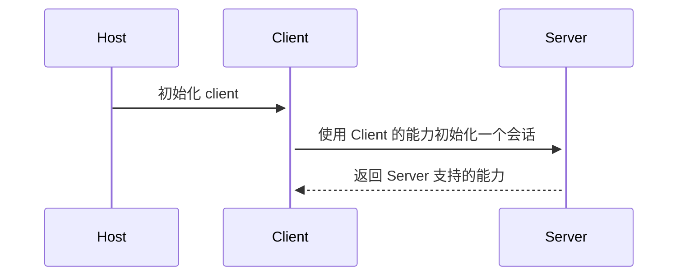
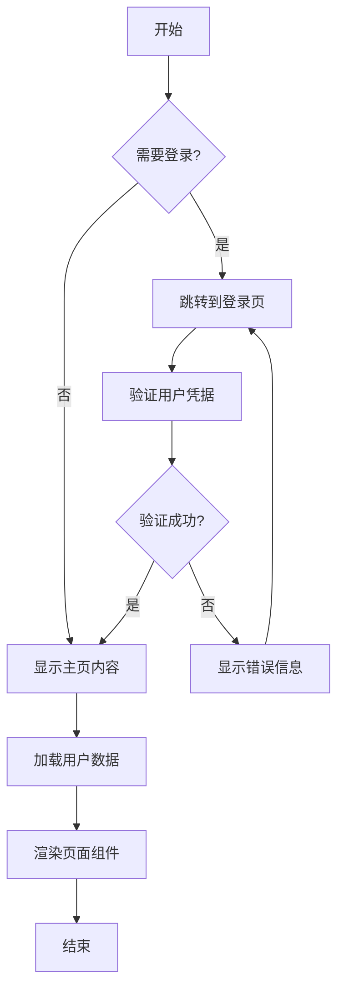
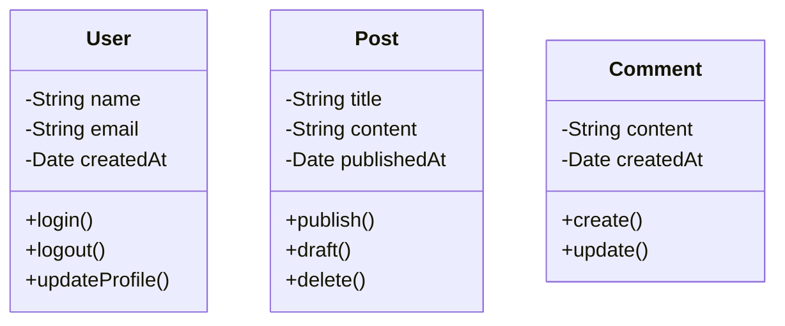
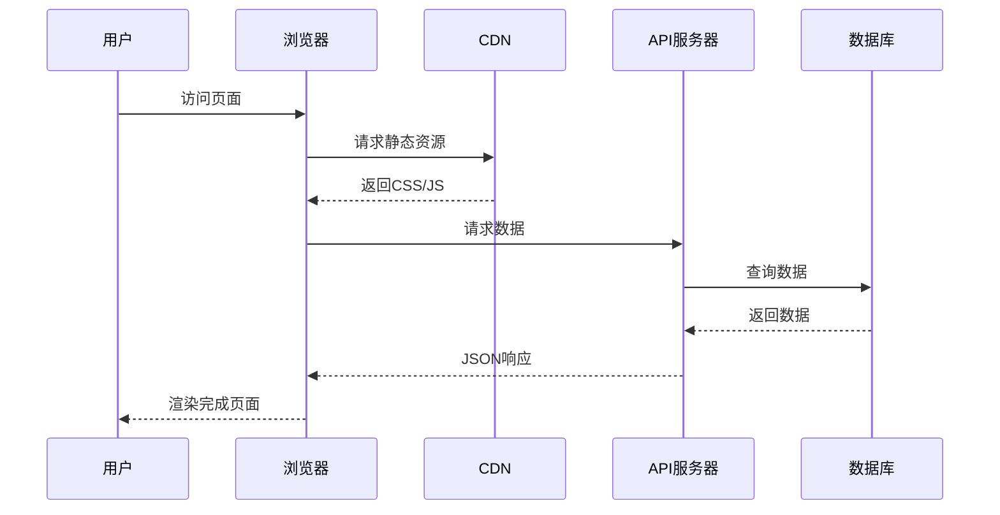

# Mermaid 图表功能测试

这篇文章用于测试 Mermaid 图表功能是否正常工作。

## 简单流程图


## 详细序列图



## 复杂流程图



## 类图示例



{/_  
 User ||--o{ Post : "创建"
Post ||--o{ Comment : "包含"
User ||--o{ Comment : "发表" _/}

## 时序图



## Git 流程图

{/\* ```mermaid
gitgraph
commit id: "Initial commit"
branch feature/mermaid
checkout feature/mermaid
commit id: "Add mermaid plugin"
commit id: "Add examples"
checkout main
merge feature/mermaid
commit id: "Release v2.1"

```*/}

如果您能看到上面的图表而不是代码块，说明 Mermaid 支持已经成功实现！
```
