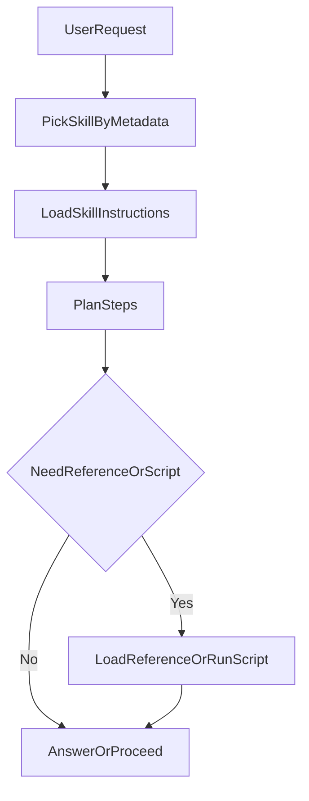

最近我在 Cursor 里干了一件很“现代”的事：把能接的东西都接上了。

GitHub、浏览器、数据库、跑脚本……工具列表越拉越长，第一次看还挺爽。但爽感很快被现实打断：模型确实“会得更多”了，**只是更容易走神**。

有时候你明明想让它做一件非常具体的事，它却开始给你讲概念；你想让它调用 A 工具，它偏偏选 B；你把工具描述写得更详细，它就更像在“看说明书考试”，而不是在“干活”。

这其实不是模型变笨了，而是我们把它塞进了一个注意力地狱：上下文越大，越难聚焦；工具越多，越难选对。

Skill 之所以让我觉得“值得写一篇”，就是因为它没有继续在“工具数量”上加码，而是换了一个更现实的方向：**把可复用的工作流写成 SOP，并且按需加载。**

---

## TL;DR

- **Skill 更像一份“可复用的 SOP（含脚本）”**：告诉模型该怎么做，而不是只告诉它“有哪些工具”。
- **关键机制是渐进式披露（Progressive Disclosure）**：先只暴露目录（元数据），确认方向后再加载手册（步骤），真正执行时才加载参考资料/脚本。
- **Skill 和 MCP 是互补关系**：MCP 像“接口/USB-C”，Skill 像“带说明书的配件包”。
- **我自己的选型**：重复性强、步骤明确、风险可控 → 先 Skill；需要稳定的外部接口/权限隔离/可观测 → MCP；需要知识召回 → RAG；需要长链路自治 → Agent/Workflow。
- **最重要的一句提醒**：Skill 很容易变成“提示注入 + 脚本执行”的组合拳，**不做边界，就等着翻车**。

---

## 1. Skill 是什么

先说清楚我这里的定义：**Skill 不是“又一套工具协议”，而是一份可复用的 SOP（必要时带脚本），用来教模型把事做完。**

第一次听到 Skill，很多人会下意识把它当成：

- 另一种 prompt 模板
- 另一种 workflow
- 另一种“工具集合”

这些都像，但不完全对。

我更愿意用一个程序员能秒懂的类比：

> MCP 更像 USB-C 接口；Skill 更像你买回来的“扩展坞套装”，里面不仅有转接头，还有一张写得很清楚的使用说明，甚至附带了驱动和脚本。

也就是说，Skill 的核心不是“再定义一套工具协议”，而是：

- **把一件事如何完成写清楚（SOP）**
- **把必要的参考资料和脚本打包**
- **让 Agent 在需要时再加载这些信息**

你不需要在每次对话都把 SOP 贴一遍，也不需要把几十个工具定义全塞进系统提示词里。它更像你电脑里那个“用得上再打开”的文件夹。

---

## 2. Skill 长什么样

从形态上看，它就是一个文件夹；从作用上看，它更像一份“可执行的说明书”。

不同产品/生态的目录约定不完全一样，但我认为一个“靠谱的 Skill 包”至少要有三样东西：

- **`SKILL.md`**：最关键，写清楚目标、触发条件、步骤、注意事项、边界。
- **`reference/`（可选）**：更长的参考资料，比如某个系统的约束、API 文档摘录、格式规范。
- **`scripts/`（可选）**：真正干活的脚本（调用 API、执行命令、读写文件等）。

注意这里的顺序：**先有手册，再有脚本**。很多“用着不稳”的 Skill，问题不在脚本，而在手册写得含糊：目标不清、步骤太粗、异常没兜底、权限没边界。

我现在写 Skill 的一个硬性要求是：`SKILL.md` 里必须出现“不要做什么”，而不仅是“怎么做”。

---

## 3. 渐进式披露

这一节只讲一件事：Skill 解决的重点不是“能力”，而是**上下文成本**——信息该什么时候进上下文、进多少。

如果你之前看过我写的 MCP（比如《[Model Context Protocol (MCP) 快速开始](/blog/202503/MCP_Quick_Start)》），你会很自然地想到一个问题：

> 既然 MCP 能列出所有 tools，那 Skill 到底解决了什么新问题？

我自己的答案是：**Skill 主要解决的是“把什么信息放进上下文”**。

### 3.1 三层漏斗

渐进式披露的思路非常像查资料：

1. **先看目录（Metadata）**：只知道“我会什么”。
2. **再翻手册（Instructions）**：确定“这件事怎么做”。
3. **真正执行时才拿材料（Reference/Scripts）**：该查资料查资料，该跑脚本跑脚本。

用一张最粗的流程图表达就是：




### 3.2 为什么重要

当你把工具越接越多时，通常会发生两件事：

1. **Token 成本上升**：每次对话都要带上“全量工具说明”，很奢侈。
2. **注意力被稀释**：模型要在更大的候选集合里做选择，越容易“选错但说得很像对”。

很多人把第二点理解成“模型不够聪明”。我更倾向于把它理解为：你让它在一个嘈杂的房间里听你说话，它当然容易听错。

Skill 的做法不是让房间更大，而是先把不相关的人请出去。

---

## 4. Skill vs MCP

先给结论：它俩更像“分工”，不是“替代”。MCP 负责连接，Skill 负责流程。

Skill 生态很容易被营销成“更好的 MCP”。这种说法我不太认同。

更准确的关系是：

- **MCP**：解决“怎么连外部世界”，是接口与协议层。
- **Skill**：解决“怎么把一件事做完”，是流程与知识层。

### 4.1 快速对比

| 维度           | Skill                  | MCP                           |
| -------------- | ---------------------- | ----------------------------- |
| 核心定位       | SOP + 资源打包         | 工具/资源访问协议             |
| 关键价值       | 渐进式披露、复用工作流 | 标准化连接、权限/隔离、可扩展 |
| 信息进入上下文 | 可按需加载（漏斗式）   | 往往需要把工具定义提前暴露    |
| 适合场景       | 重复性工作、步骤明确   | 稳定连接外部系统/数据源       |
| 风险点         | 提示注入、脚本乱跑     | 工具滥用、权限配置不当        |

### 4.2 我的选型原则

我现在基本按这几条做决策：

- **这件事有没有“固定步骤”**：有 → Skill 候选；没有 → 先别 Skill。
- **需不需要稳定对外接口**（数据库/API/服务调用）：需要 → MCP 更合适。
- **失败成本高不高**：高 → 别靠“提示词自觉”，要做工程化边界（权限、审计、回滚）。

一句话总结：

> **MCP 负责把手伸出去，Skill 负责教你怎么用手把事情做完。**

---

## 5. Skill vs 其他方案

Skill 很好用，但它不是万能胶；这一节我想把边界一次说明白：哪些问题适合 Skill，哪些问题应该交给 RAG / Workflow / 工程规范。

我见过不少团队把 Skill 当成万能胶：知识检索也 Skill、复杂决策也 Skill、多轮状态机也 Skill。

结果就是：`SKILL.md` 越写越长，最后又回到了“上下文爆炸”。

### 5.1 什么时候用

- 任务步骤稳定，变化不大（比如“文章润色”“生成图表”“按规范 Review”）
- 输入输出清晰（你能定义“做完是什么样”）
- 你愿意把异常和边界写清楚（这点比你想象中更重要）

### 5.2 什么时候不用

- **核心问题是“知识召回”**：这通常是 RAG 的地盘。Skill 可以指导怎么查，但知识本身不要塞进 Skill。
- **核心问题是“长链路自治 + 状态管理”**：这更像 Agent/Workflow。Skill 可以作为某一步的插件，但不适合承载整个系统。
- **核心问题是“工程约束/验收标准”**：这更像你项目里的 Spec、Lint、Test、CI。写在 Skill 里不如写在仓库里。

---

## 6. 最小落地

我不打算把这一节写成“安装说明”，更想用一个我自己真实会用的例子，把 Skill 的工作方式讲清楚。

我最常用 Skill 的场景其实很朴素：**重复性写作与重构**。

比如写博文这件事，本质上也是一套 SOP：

- 先定“要解决哪个痛点”
- 再给 TL;DR
- 再分段推进（定义 → 机制 → 对比 → 实战 → 风险）
- 最后收束观点 + 给参考资料

Skill 适合把这套流程固化下来，让模型每次都按同一套节奏输出，而不是每次都“凭感觉发挥”。

> 你会发现：当步骤明确后，模型的发挥反而更稳定。  
> 不稳定的往往不是语言能力，而是你给它的任务形态。

我最近还用它做了一件更“具体”的事：**把一篇草稿从“能看”改到“能发”**。

以前我会在对话框里反复补充要求：

- 标题要更克制一点
- 开头别太像营销文
- 中间要有对比表和选型原则
- 结尾给参考资料，别硬凑鸡汤

但你会发现，这种“补丁式交互”有个副作用：你越改越像在写一份新的 prompt，而不是在改文章。

后来我把它整理成一个 Skill，结构非常简单：

- **先做诊断**：这篇文章的核心命题是什么？读者读完应该带走什么？目前哪几段最散？
- **再做重构**：TL;DR 是否能覆盖全文？标题/小标题是否能串起论证链路？
- **最后做润色**：只改表达，不改结论；只删赘述，不扩写新观点；保持段落节奏一致。

这套流程一旦固化下来，后面每次改稿基本就是一句话触发：**“按我的写作 Skill 走一遍，先给我结构问题，再给精修版。”**

如果你要一个更“工具感”的例子：让它生成 Excalidraw 架构图也类似。Skill 做的不是“会画图”，而是把“需求澄清 → 结构拆解 → 绘图指令 → 导出校验”写成固定流程，模型照着走即可。

---

## 7. 怎么写 Skill

写 Skill 这事，最容易踩的坑不是“写不出来”，而是写得太虚：目标不清、步骤太粗、边界缺失，最后变成一个会瞎跑的脚本入口。

我写 Skill 时会用一个 checklist 自检（很像我在工程里写 Spec 的习惯）：

- **目标一句话讲清楚了吗？**（不要超过两行）
- **输入是什么？输出是什么？**（最好能举 1 个例子）
- **步骤颗粒度够不够细？**（细到“能直接执行”，而不是“自己悟”）
- **异常怎么处理？**（失败兜底、重试、降级、停止条件）
- **明确写了哪些事不要做吗？**（权限边界、禁止联网/禁止外传/禁止删除）

一个最小目录结构大概是这样：

```text
my-skill/
  SKILL.md
  reference/
    style-guide.md
  scripts/
    run.sh
```

> 我建议：脚本越强，手册越要啰嗦。  
> 因为脚本的破坏力通常比你想象的大。

### 7.1 `SKILL.md` 骨架

如果你要我给一个“最像工程”的写法，我会建议把 `SKILL.md` 拆成四块：

1. **目标**：一句话，不要解释背景。
2. **输入/输出**：列清楚，最好带 1 个例子。
3. **步骤**：每一步都能执行/检查，不要写“自行判断”。
4. **边界**：禁止事项 + 停止条件 + 失败兜底。

这几块写清楚，Skill 的稳定性通常就不会太差。

---

## 8. 风险与安全

这一节我会说得更直白一点：Skill 一旦具备执行能力，就必须按“线上脚本”的标准来约束，否则迟早出事。

Skill 一旦和脚本结合，就很容易出现一个危险组合：

> **提示注入（让模型做不该做的事） + 可执行能力（脚本/系统命令）**

这不是“模型不够乖”，而是攻击面真的存在。

### 8.1 我担心什么

- **供应链风险**：Skill 包从哪来？有没有被投毒？
- **权限过大**：默认给了读写全盘/访问所有 token/随便发网请求。
- **提示注入**：reference 里夹带指令，或外部网页内容诱导模型越权。
- **数据泄露**：把本地文件/密钥/隐私信息带到外部服务里。

### 8.2 我怎么做（偏保守）

- **只装来源可信的 Skill**：能看源码就看源码，不能看就别装。
- **最小权限**：能不给文件写权限就不给；能不给网络就不给。
- **默认“只读模式”**：先让它产出 plan/patch，再决定是否执行。
- **把密钥当炸药管**：不要让 Skill 自己“顺手”去读 `.env`、浏览器 Cookie、云端 token。

这套方法不完美，但能让你少踩很多“当场爆炸”的坑。

### 8.3 红线清单

下面这些场景，我基本不会把执行权直接交给 Skill（至少不会在没审计/没回滚的情况下交出去）：

- **涉及删改仓库关键文件**（比如 CI、发布脚本、权限配置）
- **涉及资金/订单/支付**（哪怕只是“调用接口”）
- **涉及个人隐私数据**（通讯录、地理位置、聊天记录）
- **涉及长期有效的 token/凭证**（能换就换成短期 token，能用代理就别直连）

一句话：Skill 可以很强，但强到一定程度，就得像对待线上脚本一样对待它。

---

## 写在最后

我现在越来越倾向于一个判断：

> 在 Agent 时代，真正稀缺的不是“工具”，而是“可复用的正确流程”。

Skill 的价值就在这里：它把流程沉淀为可按需加载的 SOP，让模型少走弯路，也让你少当一次次的“人肉提示词编辑器”。

下一篇我想写得更具体一点：把一个“写作/改稿 Skill”真的做成一个可复用包（包含边界、验收标准和安全护栏），看它能不能在真实场景里稳定跑起来。

## Reference

- [Model Context Protocol Introduction](https://modelcontextprotocol.io/introduction)
- [Model Context Protocol Quickstart](/blog/202503/MCP_Quick_Start)
- [再谈 MCP - Model Context Protocol（MCP）详解和开发教程](/blog/202507/MCP_Revisited)
- [以「asset-price-mcp」为例，从 0 开发 MCP Server](/blog/202504/The_First_MCP_Server)
